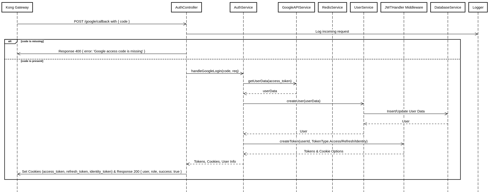
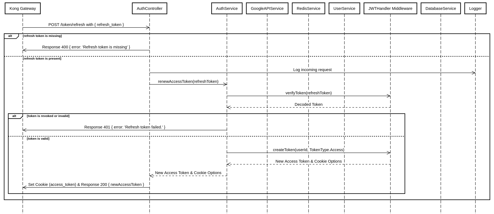
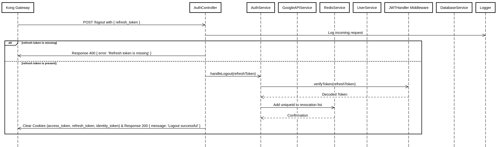

# Sequence Diagram

Refer to the following sequence diagrams for more information. It is not reccomended to start this project in isolation.
Please write your own custom docker-compose file to run this in conjunction with a client and an instance of Kong. 

## Google Login flow

## Refresh Token flow

## Logout flow

