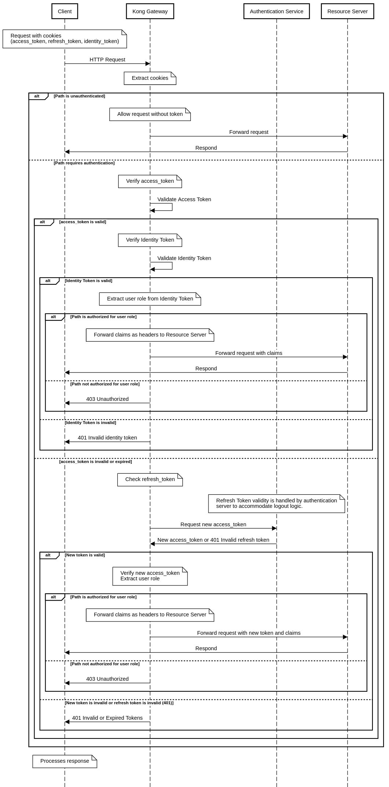

# Kong Setup

## Testings
Kong has a [very bad infrastructure](https://github.com/Kong/kong/issues/1901) to allow for testing custom plugins. Everything here is manually tested. Should you find
any bugs, please open an Issue on GitHub.


## Sequence Diagram for the plugin



## Configuration of YAML file

### Services and Routes
In your Kong YAML file (kong.yaml), you define services and their associated routes. Here's a breakdown of how to configure them:

Define Services: Services are external APIs or microservices that Kong manages.

Example:

```yaml
services:
  - name: service-one
    url: http://service-one
Define Routes: Routes specify paths and other rules to match client requests to services.
```
Example:

```yaml
routes:
  - name: one
    paths:
      - /one
```

### Custom Authentication Plugin (authn-kong)
This plugin manages authentication and access control. Here's how you can configure it:

1. Plugin Declaration: Include the plugin in your YAML file under the plugins section.

```yaml
plugins:
  - name: authn-kong
```  
2. Configuration: Customize the plugin's behavior using the config block.

jwt_secret: A secret key used for JWT token verification.
refresh_url: URL to refresh the access token.
logout_url: URL to logout users.
role_access_rules: Define access rules based on user roles.

### Creating New Roles and Access Paths
To create new roles and define access paths for them, use the role_access_rules configuration in the plugin section.

Example:

```yaml
# The path /admin/dashboard signifies that the service defined at paths: /admin will be used.
# This roughly translates to localhost/admin/dashboard 
role_access_rules:
  "admin": ["/admin/dashboard", "/admin/settings"]
  "user": ["/user/profile", "/user/settings"]
```

Here, admin and user are roles, each with specific paths they can access. 


### URLs and Access Control
Accessing Services: Users access services through the routes defined. For example, to access service-one, users would go to http://<your_kong_host>/one if Kong is hosted at <your_kong_host> and /one is the route path.

Role-Based Access: Users are allowed or denied access based on their role and the paths defined in role_access_rules. For instance, a user with the admin role can access http://<your_kong_host>/admin/dashboard.